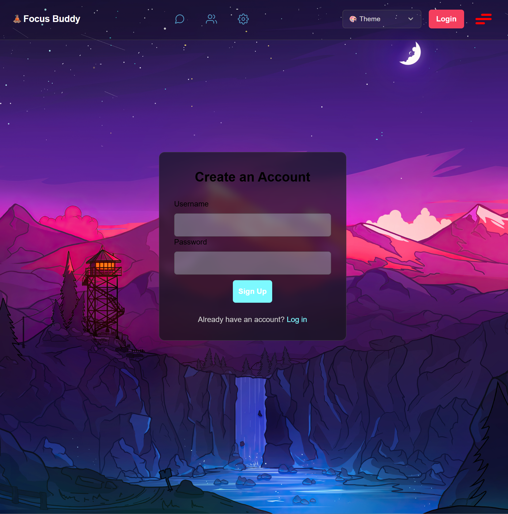
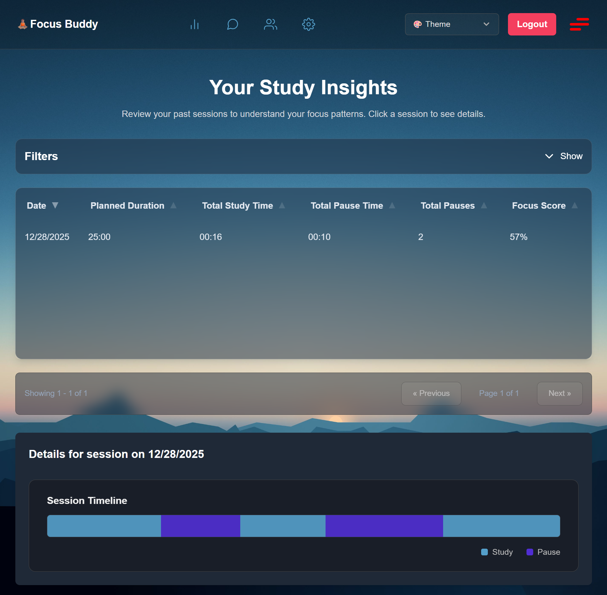

# Focus Buddy

A Svelte/SvelteKit app for tracking focus/study sessions and viewing insights. Built with Svelte 5 + Vite, backed by Postgres (Kysely) and Lucia for auth.






## Stack

- SvelteKit (Svelte 5) + Vite
- Tailwind CSS
- Postgres + Kysely
- Lucia auth

## Quick start

```bash
npm ci
docker compose up -d
npm run dev
```

Open the URL printed by Vite (usually `http://localhost:5173`).

## Database

Local Postgres is provided via `docker-compose.yml` on `localhost:5433` with:

- database: `study_tracker_db`
- user/password: `postgres` / `postgres`

`npm run dev` / `npm run preview` run Kysely migrations automatically. To run them manually (or for troubleshooting):

```bash
npm run db:migrate:up
```

DB connection settings live in `src/lib/server/db/db.ts`.

## Useful scripts

- `npm run dev` runs doctor + migrations, then starts the dev server
- `npm run db:migrate:up` runs migrations manually
- `npm run check` typecheck + svelte-check
